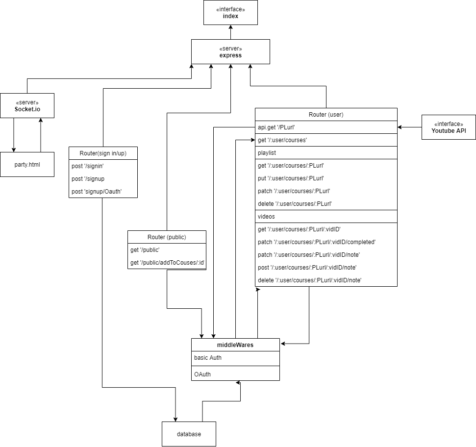
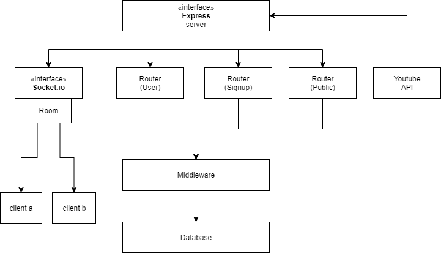
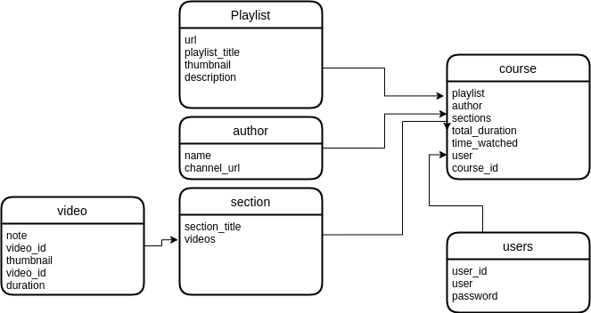

# cousre-Fellows

## Members

- Bayan alalem [GitHub](https://github.com/bayan-97)
- Dina Alsaid [GitHub](https://github.com/dinaAlsaid)
- Mohammad Eshtaiwi [GitHub](https://github.com/Mohammad-Eshtaiwi)

## Description

Course-fellows is an organizing tool for self-paced online learners, that will help them manage their courses the way they like. It helps with keeping track of the learning progress for each course. The web app will enable a community of learners to share their thoughts on the courses they took, and connect them together through their learning journey.

## Deployed app

[Course-Fellows](https://course-fellows.herokuapp.com/)

## Initial wireframe

[wireframe](https://miro.com/app/board/o9J_lfE_Fpw=/)

## Technologies

Back-end /server-side:

- Node.js
- Express.js
- MongoDB
- Socket.io

## Libraries/dependencies

- moment: link
- base-64
- cors
- dotenv
- ejs
- googleapis
- jsonwebtoken
- mongoose
- socket.io
- supertest
- uniqid
- url-params-parser

## Endpoints

`POST /signup`  
`POST /signin`  
`GET /oauth`  
`GET /playlist`  
`POST /user/:user/courses`  
`GET /user/:user/courses`  
`GET /user/:user/courses/:course`  
`POST /user/:user/courses/:course`  
`PUT /user/:user/courses/:course`  
`DELETE /user/:user/courses/:course`  
`GET /user/:user/courses/:course/:vidID`  
`PATCH /user/:user/courses/:course/:vidID/isWatched`  
`PATCH /user/:user/courses/:course/:vidID/notes`  

## PM Board

[PM board](https://github.com/team-rocket-401d5/cousre-online/projects/1)

## UML

initial:   
final:   

## ERD

